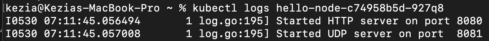
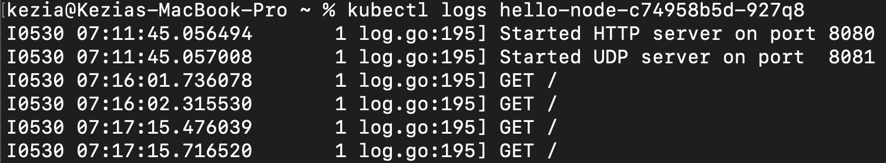
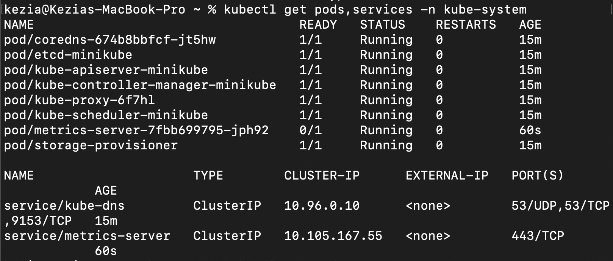

# Kezia Salsalina Agtyra Sebayang - 2306172086

## Reflection on Hello Minikube

1. Compare the application logs before and after you exposed it as a Service. Try to open the app several times while the proxy into the Service is running. What do you see in the logs? Does the number of logs increase each time you open the app?

    When I first port-forwarded directly into the pod, I only ever saw the two startup messages:
    

    After I created a Service for the deployment, everything changed. Every time I hit the app’s URL, a new log line appeared:
    
    Reloading twice gave me two GET / lines, three reloads gave three, and so on.

2. What is the purpose of the -n option and why did the output not list the pods/services that you
explicitly created?

    
    The -n flag lets me tell kubectl exactly which namespace to query instead of using the default. By default (no -n), Kubernetes looks in the “default” namespace where I deployed my own pods and services—so that’s where my resources show up. When I ran kubectl get pods -n kube-system, I was pointing at the system namespace, which only contains Kubernetes’ built-in components.